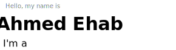
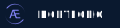

    <picture>
        
    </picture>
    <picture>
        
    </picture>

 

    <h3>About Me:</h3>
    
I find joy in building things that make life’s hard times a little easier. I believe that with love and dedication, anyone can achieve anything.

    <h3>Languages:</h3>
    
    
    
    
    
    
    

    <h3>Dev Tools:</h3>
    
    
    
    
    
    
    
    
    
    
    
    

 <h3>Github Stats:</h3>
     
    

        <picture>
            
        </picture>
        <picture>
            
        </picture>
    

 <h3>Trophies:</h3>
     
    

        <picture>
            
        </picture>
    

    <h4>Feel free to contact me</h4>
    
    
    
    
    

        
    

